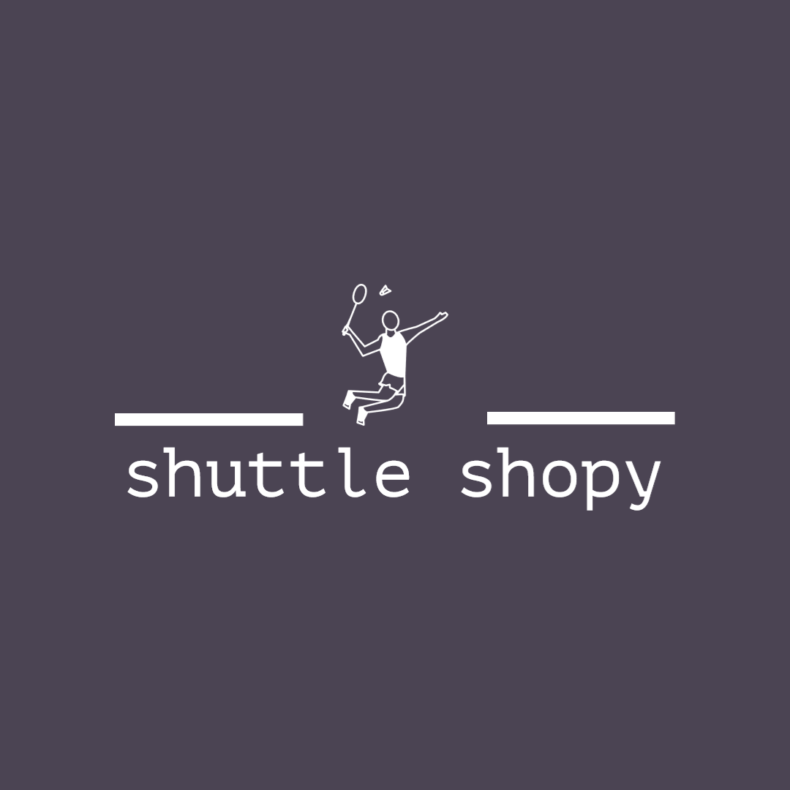

<div align="center">


# Shuttle Shopy

[](https://github.com/Maianki/shuttle-shopy-react/network)
[](https://github.com/Maianki/shuttle-shopy-react/stargazers)
</div>


---


<!-- TABLE OF CONTENTS -->
<details>
  <summary>Table of Contents</summary>
  <ol>
    <li>
      <a href="#about-shuttle-shopy">About The Project</a>
    </li>
    <li>
      <a href="#getting-started">Getting Started</a>
      <ul>
        <li><a href="#prerequisites">Prerequisites</a></li>
        <li><a href="#installation">Installation</a></li>
      </ul>
    </li>
    <li>
      <a href="#features-and-pages">Features</a>
      <ul>
      <li><a href="#home-page">Home page</a></li>
        <li><a href="#product-listing-page">Product Listing page</a></li>
        <li><a href="#cart-management">Cart Management</a></li>
        <li><a href="#wishlist-management">Wishlist Management</a></li>
        <li><a href="#alerts-and-snackbar">Alerts/Snackbar</a></li>
        <li><a href="#order-summary">Order Summary</a></li>
        <li><a href="#authentication">Authentication</a></li>
      </ul>
    </li>
  </ol>
</details>

---

## About Shuttle Shopy
Shuttle shopy is an ecommerce where you can buy all badminton related accessories - Your ultimate stop to buy all badminton equipments. Shuttle shopy is built using react, shuttle UI, react-router and mockbee as a mock backend.


---

##  Getting Started
---
### Prerequisites

You need to have `node js` and `react` installed on your local to run this app.

### Installation
Clone the repository on your local machine by typing the below commands on your terminal and cd to `shuttle-shoppy`.

```
git clone https://github.com/Maianki/shuttle-shopy-react.git

cd shuttle-motion
```

Install the necessary dependencies.

```
npm install
```

`Shuttle shopy` uses `mockbee's` mockbackend. Since, we are working with mock backend servers. We need to give our mock backend access to the JWT secret key. So, for that, go ahead and create a .env file in your root directory of the app and add the below code in it:

```
REACT_APP_JWT_SECRET = <JWT_SECRET_KEY_OF_YOUR_CHOICE>
```

Now to run the app write the following command in your terminal:


```
npm start
```

This should run the app on localhost:3000.


---

## Features and Pages

### Home page
- user can see a landing page with a list of few categories and trending products.
- If user click on any one of the categories he/she will be redirected to the product list page with the selected category.

### Product Listing Page

 - user can see a product listing page where all the products are listed with a section of filters.
 - user can apply various filters like price, category, rating etc. and can reset all filters by clicking on clear filters button.
- On product card user can add item to cart or wishlist.

### Cart Management

- user can add or remove items from cart.
- and can increase and decrease the quantity of products in the cart.
- items can also be added to cart from trending section of home page.


### Wishlist management

- user can add or remove items from wishlist.
- items can also be added to wishlist from trending section of home page.

### Alerts and snackbar

User will be notified via a snackbar when they - 
 - Add item to the cart
 - Remove Item from the cart
 - Increase or Decrease item in the cart
 - Move an item from the cart to the wishlist
 - Add item to the wishlist
 - Remove Item from the wishlist
 - Move an item from wishlist to cart

### Order Summary

- users can see the order summary card where they can see price,discount, delivery charges and total amount.

### Authentication

- User can do a guest login
- User can Log In/Log Out with existing credentials
- User can sign up by if they are new to website
- The login is persistent.

---


## Connect with me on

<a href="https://twitter.com/Ankit_k10"></a>
<a href="https://www.linkedin.com/in/ankit-kumain-4124a21b3/"></a>

## Feedback

If you have any feedback, please reach out to me at [Twitter](https://twitter.com/Ankit_k10)

